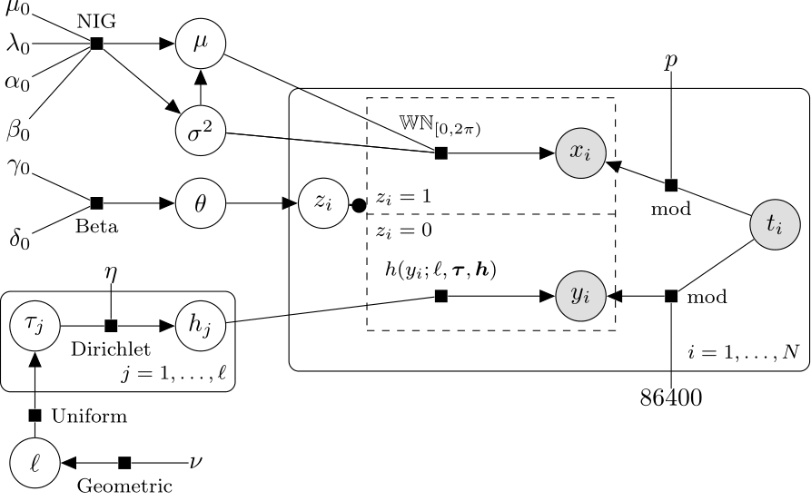

# Statistical methods for separating human and automated activity in computer network traffic

This reposit contains *python* code used to separate human and automated activity on a single edge within a computer network. 

The methodology builds up on the algorithm for detection of periodicities suggested in Heard, Rubin-Delanchy and Lawson (2014). A given edge can be classified as automated with significant level $\alpha$ according to the the $p$-value obtained from a Fourier's $g$-test. Using this method, the entire activity observed from the edge is discarded from further analysis. In many instances though, the the activity on edges in NetFlow data is a mixture between human and automated connections. Therefore, a mixture model for classification of the automated and human events on the edge is proposed. 

## Methodology

### Transforming the raw arrival times

Assume that $t_1,\dots,t_N$ are the raw arrival times of events on an edge $X\to Y$, where $X$ and $Y$ are client and server IP addresses. Also assume that the edge $X\to Y$ is strongly periodic with periodicity $p$, detected using the Fourier's $g$-test. The indicator variable $z_i$ takes the value $1$ if the event associated with the arrival time $t_i$ is automated, $0$ if it is human. Two quantities are used to make inference on $z_i$:

\begin{align*}
x_i=(t_i\ \text{mod}\ p){}\times \frac{2\pi}{p} & & y_i=(t_i\ \text{mod}\ 86400){}\times\frac{2\pi}{86400}
\end{align*}

where $86400$ is the number of seconds in one day. The $x_i$'s are **wrapped arrival times**, and the $y_i$'s are **daily arrival times**. 

### Mixture modelling

The following mixture model is used to make inference on the $z_i$'s:
\begin{equation*}
f(t_i|z_i) \propto f_A(x_i)^{z_i} f_H(y_i)^{1-z_i} 
\end{equation*}

The distribution of $f_A(\cdot)$ is chosen to be **wrapped normal**, and for $f_H(\cdot)$, a **step function** with unknown number $\ell$ of changepoints $\tau_1,\dots,\tau_\ell$ is used. The density of the wrapped normal distribution is:
\begin{equation*}
\phi_{\mathrm{WN}}^{[0,2\pi)}(x_i;\mu,\sigma^2)=\sum_{k=-\infty}^\infty \phi(x_i+2\pi k;\mu, \sigma^2)
\end{equation*}
The circular step function density for the human events is:
\begin{equation*}
h(y_i;\boldsymbol h,\boldsymbol \tau,\ell)=\frac{\mathbb{I}_{[0,\tau_{1})\cup[\tau_{\ell},2\pi)}(y_i) h_\ell}{2\pi-\tau_{\ell}+\tau_{1}}+\sum_{j=1}^{\ell-1} \frac{\mathbb{I}_{[\tau_{(j)},\tau_{j+1})}(y) h_j}{\tau_{j+1}-\tau_{j}}
\end{equation*}

In the code, a Collapsed Metropolis-within-Gibbs with Reversible Jump steps is used. Conjugate priors are used for efficient implementation.

The model is summarised in the following picture:

Inference for the wrapped normal part is simple: the prior for $(\mu,\sigma^2)$ is $\mathrm{NIG}(\mu_0,\lambda_0,\alpha_0,\beta_0)$, Normal Inverse Gamma, i.e. $\mathrm{IG}(\sigma^2\vert\alpha_0,\beta_0) \mathbb{N}(\mu\vert\mu_0,\sigma^2/\lambda_0)$. Given sampled values of $z_i$ and $\kappa_i$, with $N_1=\sum_{i=1}^N z_i$,  the conditional posterior is conjugate with the following updated parameters:
\begin{align*}
\tilde{x} &= \sum_{i:z_i=1}\nolimits (x_i+2\pi\kappa_i)/{N_1} \\
\mu_{N_1} &= \frac{\lambda_0\mu_0 + N_1\tilde{x}}{\lambda_0+N_1} \\
\lambda_{N_1} &= \lambda_0 + N_1 \\
\alpha_{N_1} &= \alpha_0 + N_1/2 \\
\beta_{N_1} &= \beta_0 + \frac{1}{2}\left\{\sum_{i:z_i=1}\nolimits (x_i+2\pi\kappa_i-\tilde{x})^2 + \frac{\lambda_0N_1}{\lambda_0+N_1}(\tilde x-\mu_0)^2 \right\}
\end{align*}

Inference for the step function for the human density uses Reversible Jump Markov Chain Monte Carlo with standard birth-death moves. The sampler heavily uses the following marginalised density:
\begin{equation*}
p(\boldsymbol{y}\vert\tau_1,\dots,\tau_\ell,\ell) = \frac{c(N,\eta)\Gamma[N-\sum_{j=1}^{\ell-1} N_{\tau_j,\tau_{j+1}}+\eta(2\pi-\tau_{\ell}+\tau_{1})]}{\Gamma[\eta(2\pi-\tau_{\ell}+\tau_{1})](2\pi-\tau_\ell+\tau_1)^{N-\sum_{h=1}^{\ell-1} N_{\tau_h,\tau_{h+1}}}} \prod_{j=1}^{\ell-1}\frac{\Gamma[N_{\tau_j,\tau_{j+1}}+\eta(\tau_{j+1}-\tau_{j})]}{\Gamma[\eta(\tau_{j+1}-\tau_{j})](\tau_{j+1}-\tau_j)^{N_{\tau_j,\tau_{j+1}}}}  
\end{equation*}

where $c(N,\eta)=\Gamma(2\pi\eta)/\Gamma(N+2\pi\eta)$ and $N_{\tau_{j},\tau_{j+1}} = \sum_{i=1}^N \mathbb{I}_{[\tau_{j},\tau_{j+1})}(y_i)$. 

## Understanding the code

The main part of the code is contained in the file `collapsed_gibbs.py`. The code in `mix_wrapped.py` is used to initialise the algorithm using a uniform - wrapped normal mixture fitted using the EM algorithm. Finally, `cps_circle.py` contains details about the proposals and utility functions used for the Reversible Jump steps for the step function density of the human component in the Gibbs sampler. For details about the periodicity detection procedure and relevant code, see the repository `fraspass/human_activity_julia`.

**- Important -** All the parameters in the code have the same names used in the paper, except `z[i]`, which does not correspond to $z_i$, but combines the latent variables $z_i$ and $\kappa_i$ used in the paper. In the code, for a given positive integer $L$, `z[i]`$\in\{-L,\dots,L,L+1\}$. When `z[i]`$=L+1$, then the event is classified as *human* ($z_i=0$), and when `z[i]`$\neq L+1$, then the event is *automated* ($z_i=1$), and the value represents a sample for $\kappa_i$, truncated to $\{-L,\dots,L\}$ for a suitably large $L$. 

## References

* Heard, N.A., Rubin-Delanchy, P.T.G. and Lawson, D.J. (2014). "Filtering automated polling traffic in computer network flow data". Proceedings - 2014 IEEE Joint Intelligence and Security Informatics Conference, JISIC 2014, 268-271. ([Link](https://ieeexplore.ieee.org/document/6975589/))
